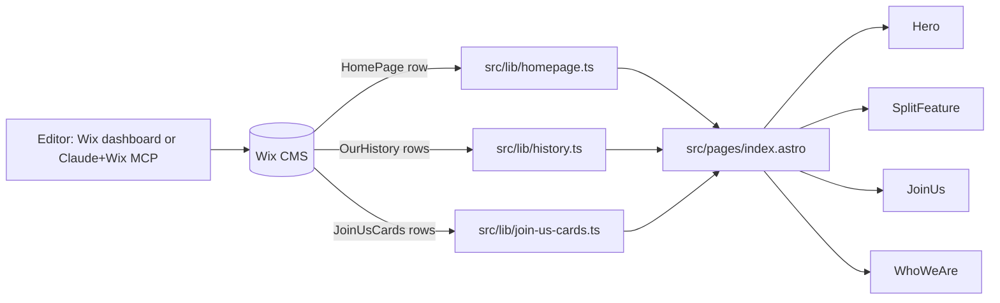

# 001 — CMS-driven content architecture for editor self-service

**Status:** implemented
**Date:** 2026-05-27
**Author:** claude-session (danielle directing)
**Related:** (first entry)

## Background

The site is built on Wix-managed headless (Astro + Wix CMS). Danielle is the developer; a non-technical collaborator needs to be able to edit copy, swap images, add slides, and update team/davening data without learning git, Node, or the Wix CLI. He uses Claude.ai (web).

Existing setup (before this entry): homepage content was hardcoded in `src/components/{Hero,SplitFeature,JoinUs,Slideshow,WhoWeAre}.astro`. Team and Davening pages already pulled from `TeamMembers` and `DaveningTimes` collections via `@wix/wix-data-items-sdk`.

## Problem

Every visible string and image on the homepage required a code change → PR → review cycle. That's the wrong abstraction for content the office will touch frequently. We needed to:

1. Move editable surfaces (copy, hero image, slideshow images, card labels) into a Wix-dashboard-editable layer.
2. Keep the *structure* (layout, sections, styling, behavior) in code.
3. Avoid breaking the existing homepage during the transition — page must render identically before and after the CMS is populated.
4. Give the friend a single discoverable place to learn his workflow.

## Questions and Answers

- **Q:** Single-row `HomePage` collection vs. key/value `SiteContent` collection?
  **A:** Single-row, structured. Wix CMS Image fields are typed and can't be stored as strings in a key/value pattern. Key/value would also lose IDE-level field-name autocomplete on the code side.

- **Q:** Should each split section (Unique/Impactful, Torah Vision) be its own collection row, allowing arbitrary numbers of split sections?
  **A:** Not yet. Two sections is the design; making it generic adds a "build any homepage you want" surface that the editor doesn't need. Revisit when there are 3+.

- **Q:** Rich Text or plain Text for body copy?
  **A:** Plain Text for now. Bios on `TeamMembers` are Rich Text (Ricos JSON) because they're long-form. Homepage body copy is one short paragraph per section — no formatting needed, and Ricos rendering adds complexity.

## Design

Three new collections, fed via three new lib modules, consumed by the existing components (now prop-driven with internal defaults).



**Collections:**

- `HomePage` — single row, ~24 typed fields covering hero, two split sections, Who We Are. Image fields are Wix Image type (returns `wix:image://...` URL resolved via `media.getScaledToFillImageUrl`).
- `OurHistory` (originally `HomepageSlides`, renamed + reframed as a timeline in [#015](015-history-timeline.md)) — one row per milestone. Fields: `image`, `year`, `title`, `caption`, `sortOrder`, `active`.
- `JoinUsCards` — one row per card (3 expected). Fields: `title`, `subtitle`, `href`, `icon` (one of: `book`, `reader`, `people`), `sortOrder`, `active`.

**Lib pattern** (per project convention from `node_modules/@wix/agent-skills/skills/wix-headless`):

```ts
import * as items from "@wix/wix-data-items-sdk";
import { auth } from "@wix/essentials";

export async function getHomePage(): Promise<HomePageContent | null> {
  try {
    const elevated = auth.elevate(items.query);
    const { items: results } = await elevated("HomePage").limit(1).find();
    // ...resolve images, return shape
  } catch (err) {
    console.error(`[homepage] query failed:`, err);
    return null;
  }
}
```

Two non-negotiables on every query: `auth.elevate` (without it, restricted collections silently return zero items) and try/catch (without it, an SSR exception truncates the Astro response mid-body — nav renders, then blank).

**Component pattern:** each homepage component accepts optional content props with internal defaults matching the current hardcoded text/images. When CMS returns nothing, defaults win → page looks identical to pre-CMS. When CMS returns content, that overrides → no code change needed.

## Trade-offs

- **Single-row `HomePage` is awkward in Wix's row-oriented dashboard.** The "Manage Items" UI assumes lists. One-row collections work but feel weird. Acceptable for now; if multiple "settings" emerge, consolidate into one `SiteSettings` row.
- **Field names are stringly-typed contracts** between the dashboard and the code. A rename in the dashboard silently breaks queries (the row returns, but the typed field is `undefined`). Mitigation: documented exact names in `CONTRIBUTING.md` + this log; any future rename must be flagged in a new design log entry.
- **Wix MCP setup is the friend's responsibility.** We're not automating his side of the wire. If he never sets it up, he uses the dashboard directly — slower but works.

## Implementation Results

Shipped in two commits:

- **`805b84c`** — Team and Daven pages (precursor work; introduced the lib + try/catch + auth.elevate pattern this entry now extends to the homepage).
- **`1b9d250`** — CMS-drive homepage content + add CONTRIBUTING.

Followup risk: the field-name contract is the most likely thing to break under non-developer hands. If it does, the fix is a Zod (or hand-rolled) schema layer at the lib boundary that fails loud when fields are missing, instead of silently using `undefined`.
