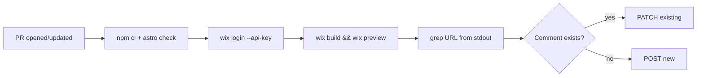

# 002 — PR preview deployments via GitHub Actions

**Status:** implemented
**Date:** 2026-05-27
**Author:** claude-session (danielle directing)
**Related:** [#001](001-cms-driven-content-architecture.md)

## Background

The non-technical collaborator opens code PRs via Claude.ai + GitHub MCP (no local dev environment). Without per-PR previews, Danielle has to `git fetch` + `wix dev` every PR to see the visual change — the bottleneck #001 was supposed to lift moves to her. The point of moving content into the CMS was to make code PRs rare; the few that do show up shouldn't require a context switch.

## Problem

For each code PR we need:

1. A deployed preview URL both parties can click to see the actual rendered site (not just the diff).
2. The preview must be **unique per PR / per commit** — concurrent PRs cannot overwrite each other's slot.
3. The workflow must run in CI, authenticated non-interactively. No "log in as Danielle to test it."
4. The friend should not need to learn anything new beyond "open a PR; click the preview link the bot posts."

## Questions and Answers

- **Q:** Does `wix preview` produce unique URLs per call, or overwrite a single preview slot?
  **A:** Unique per call. Per the official docs ([development-build-and-deployment](https://dev.wix.com/docs/go-headless/develop-your-project/wix-managed-headless/core-concepts/development-build-and-deployment) and [preview command reference](https://dev.wix.com/docs/wix-cli/command-reference/project-commands/preview)): "Each preview URL directs to a unique version of your project hosted on Wix's servers. Subsequent updates to your project won't affect any previously created versions." This is what makes per-PR previews safe.

- **Q:** How do we authenticate the CLI non-interactively in CI?
  **A:** `wix login --api-key <token>`. Documented for "automations and CI environments." The token is stored as a GitHub repo secret `WIX_API_KEY`.

- **Q:** Use a third-party Action for sticky PR comments (e.g. `marocchino/sticky-pull-request-comment`)?
  **A:** No. Keeping the dependency surface minimal — wrote ~30 lines of bash using `gh api` to find a comment by marker and PATCH if exists / POST if not. One fewer Action to audit/upgrade.

- **Q:** Auto-release on merge to main?
  **A:** No, manual `wix release` for now. We have zero tests. Every merge being a prod ship is too much trust in `astro check` alone. Revisit after we have a real test suite.

- **Q:** Run unit tests in the workflow?
  **A:** No test suite yet, but added `astro check` (TypeScript + Astro type validation). Cheap, catches a lot, and worth doing before burning a preview deployment on a broken build.

- **Q:** What about secret exfiltration from PR code? A malicious `postinstall` in a PR's `package.json` could read `WIX_API_KEY` from the workflow env.
  **A:** Trust model. Sole contributor with PR write access is a known trusted person. If the contributor set expands, enable GitHub's "Require approval for first-time contributors" setting. Documented this caveat in `CONTRIBUTING.md`.

- **Q:** Does `pull_request_target` give us more or less security?
  **A:** Less. `pull_request_target` runs in the base-branch context but checks out PR code — that's the famously exploitable footgun. `pull_request` (what we use) only has secrets for same-repo branches, not fork PRs. Friend works on branches in the repo, not via fork, so this is the right event.

- **Q:** How do we prevent the friend from merging his own PRs / pushing directly to main?
  **A:** Branch protection rules. **But:** classic branch protection AND rulesets are both gated behind GitHub Pro on private repos. On a free private repo, neither is available. Options: (a) upgrade to Pro, (b) make repo public, (c) accept the trust model. Pending decision. Workflow itself does not depend on this — it runs regardless.

## Design

Single workflow file `.github/workflows/pr-preview.yml`. Trigger: `pull_request` (opened, synchronize, reopened). Concurrency group per PR with `cancel-in-progress: true` — push a new commit and the old preview build is cancelled, saving CI minutes.

Steps:

1. Checkout PR branch
2. Setup Node 20 + npm cache
3. `npm ci`
4. `npx astro check` (typecheck)
5. `npx wix login --api-key "$WIX_API_KEY"` (fails early if secret unset)
6. `npx wix build`
7. `npx wix preview` — capture stdout, extract first `https://*wix*` URL via grep
8. Find existing preview comment by marker `<!-- rck:pr-preview -->`, PATCH if exists / POST otherwise — single sticky comment per PR

Permissions: `pull-requests: write` (for the comment), `contents: read` (for checkout). No write to contents — the workflow never commits.



## Implementation Plan

1. Install `@astrojs/check` + `typescript` as dev deps so `npx astro check` runs in CI.
2. Generate Wix API key in Wix dashboard, set as `WIX_API_KEY` repo secret via `gh secret set`.
3. Write `.github/workflows/pr-preview.yml`.
4. Update `CONTRIBUTING.md` with friend's new code-PR workflow + security caveat.
5. Branch protection — left to user to configure (free private repo limitation surfaced).

## Examples

✅ **Right** — sticky comment with marker, updates in place:
```bash
MARKER='<!-- rck:pr-preview -->'
EXISTING_ID=$(gh api ... --jq ".[] | select(.body | startswith(\"$MARKER\")) | .id" | head -1)
if [ -n "$EXISTING_ID" ]; then gh api -X PATCH ...; else gh api -X POST ...; fi
```

❌ **Wrong** — `gh pr comment --edit-last`:
The "last" comment might be a human reply, not the bot's. Marker-based lookup is robust to interleaved comments.

✅ **Right** — `wix login --api-key "$WIX_API_KEY"` with key as env var:
```yaml
env:
  WIX_API_KEY: ${{ secrets.WIX_API_KEY }}
run: npx wix login --api-key "$WIX_API_KEY"
```

❌ **Wrong** — interpolating the secret directly into the run script:
```yaml
run: npx wix login --api-key ${{ secrets.WIX_API_KEY }}
```
GitHub redacts secrets from logs anyway, but the env-var pattern keeps the secret out of the shell command argv, which appears in `ps` output on the runner.

## Trade-offs

- **Workflow runs even on draft PRs.** Could gate with `if: github.event.pull_request.draft == false` to skip drafts. Not worth it for our scale — the friend rarely drafts.
- **`wix preview` URL extraction relies on stdout regex.** If Wix changes the CLI output format, the regex breaks. Mitigation: the workflow fails loudly (`exit 1`) if no URL extracted, with the full stdout dumped to logs — easy to fix when it happens.
- **No automatic cleanup of stale previews.** Wix doesn't garbage-collect old preview deployments AFAIK. Acceptable; we don't pay per preview.
- **Trust model on secret exfiltration.** Documented. Re-evaluate when contributor count > 1.
- **Branch protection gated behind GitHub Pro on private repos.** Out of scope for this entry; will be its own follow-up decision.

## Verification

- [ ] Open a test PR with a trivial visible change (e.g. text tweak). Expect: green check, bot comment with a `https://...wix...` URL, clicking URL shows the change rendered.
- [ ] Push a new commit to the same PR. Expect: previous workflow cancelled (yellow circle, not red ✕), new run produces a new URL, the bot **edits the existing comment** (not a second comment).
- [ ] Introduce a TypeScript error deliberately. Expect: workflow fails at `astro check` step, no preview created, no spurious comment posted.
- [ ] Set `WIX_API_KEY` to empty / unset. Expect: workflow fails at "Authenticate to Wix" with the explicit error message we wrote, not a confusing `wix login` crash.

## Implementation Results

Shipped in commit `<sha>` (pending push). Workflow file at `.github/workflows/pr-preview.yml`. `@astrojs/check` and `typescript` added to devDependencies.

**Deviations from design:** none.

**Pending verification:** all four checks above. The user will exercise the workflow with a real test PR.

**Follow-up:** branch protection on `main`. Decision: **accept trust model** — branch protection on private repos is gated behind GitHub Pro; the user opted not to upgrade and not to make the repo public for now. CONTRIBUTING.md was updated to remove the (incorrect) "branch protection blocks direct pushes" claim and explicitly call out the convention. Revisit if/when the contributor set expands beyond the current trusted two.
