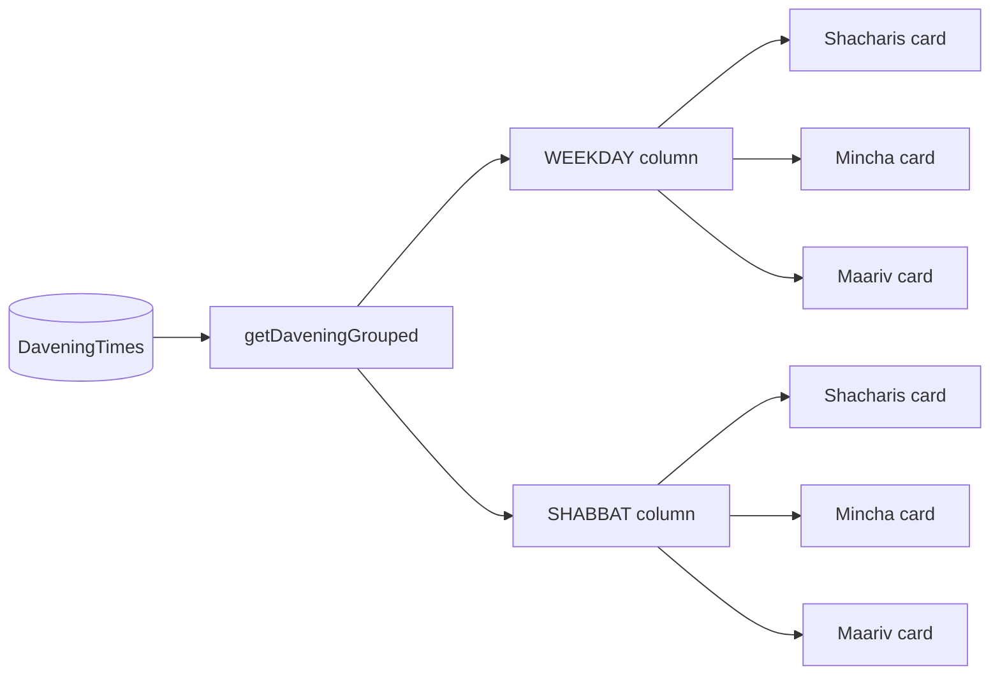

# 004 — Davening schedule: add daySpec field, service-grouped card layout

**Status:** implemented
**Date:** 2026-05-28
**Author:** claude-session (danielle directing)
**Related:** [#001](001-cms-driven-content-architecture.md)

## Background

#001 shipped `DaveningTimes` with six fields: `service`, `dayType` ("Weekday" or "Shabbat"), `time`, `notes`, `sortOrder`, `active`. The /daven page renders one card per dayType with a flat row list: service + notes + time.

A separate session populated 10 demo rows. With realistic data, two failure modes surfaced:

1. **`notes` is overloaded.** It was meant for context like "followed by daf yomi", but with no other field to hold day-of-week specificity, editors put "Monday & Thursday (Torah reading)", "Sunday – Thursday, followed by daf yomi", "Erev Shabbat — see weekly bulletin". The day-of-week info is the primary information; the actual notes are an aside.
2. **Service variants are siblings, not children.** Four "Shacharis" rows (Sun, Mon-Thu, Tue-Wed-Fri, Rosh Chodesh) sit at the same level as Mincha and Maariv, with the day-of-week distinction buried in `notes`. People scan by service ("what time is Mincha?"); the layout makes them re-parse the service name on every row.

The visual result: a 7-row Weekday card next to a 3-row Shabbat card with redundant service repetition and notes doing double duty.

## Problem

Two coupled problems with a single fix:

1. Schema needs a place for day-of-week specificity that isn't `notes`.
2. Layout needs to group rows by service so the variants read as children of a service header.

## Questions and Answers

- **Q:** Could we just parse `notes` to extract day-of-week info?
  **A:** Fragile. Relies on string convention ("Monday & Thursday" vs "Mon-Thu" vs "Mondays") that drifts the moment an editor types something unexpected. New first-class field is cleaner.

- **Q:** Should `dayType` get more granular values (Sunday, Mon-Thu, Tue-Wed-Fri, Shabbat, …) so we don't need `daySpec`?
  **A:** No — the editor explicitly said "Keep it as is for now" in a prior session. The dayType binary (Weekday / Shabbat) is the *top-level* split the page presents (two columns). Day-of-week specificity is a *secondary* axis within Weekday and belongs in its own field, not by exploding the enum.

- **Q:** What's the right format for `daySpec` values?
  **A:** Whatever's short and scannable. Examples documented in CONTRIBUTING: `Sunday`, `Mon, Thu`, `Tue, Wed, Fri`, `Sun – Thu`, `Rosh Chodesh`, `Erev Shabbat`, `Motzei Shabbat`. Free text — no alias map yet because there are only ~7 common values and they tend to be edited rarely. If editors start typing inconsistent variants (e.g. "Sundays" vs "Sunday"), reach for the alias-map pattern from #003.

- **Q:** What's shown when `daySpec` is empty (e.g. the one Shabbat Shacharis row)?
  **A:** The card already has a "SHACHARIS" header, so the row's left label falls back to the column's dayType label ("Shabbat"). For a card with one variant, this reads naturally: SHACHARIS → "Shabbat 9:00 AM".

- **Q:** Hover state on the cards?
  **A:** Subtle shadow lift on hover. Not click-to-expand (no hidden content). Matches the team page's card-hover language.

- **Q:** Tab UI? Single combined column?
  **A:** Editor picked the two-column service-grouped cards option after seeing ASCII previews of all three. Tabs hide the off-tab content; combined column drops the explicit dayType split the editor said they like.

## Design

**Schema** — append one Text field to `DaveningTimes`:

| Field | Type | Description |
|---|---|---|
| daySpec | Text (optional) | Day-of-week specificity. Free text, e.g. `Sunday`, `Mon, Thu`, `Sun – Thu`. Empty falls back to the dayType label. |

`notes` field's description tightened: explicitly should *not* carry day-of-week info anymore — that's daySpec's job.

**Lib** — `src/lib/davening.ts` exports a new `getDaveningGrouped()` that returns `Record<DayType, ServiceGroup[]>` where each `ServiceGroup` is `{ service, rows: DaveningTime[] }`. Services are ordered Shacharis → Mincha → Maariv → Selichos via a canonical rank function.

**Page** — `src/pages/daven.astro` renders two columns side-by-side. Each column has a `WEEKDAY` / `SHABBAT` header, then a vertical stack of service cards (Shacharis, Mincha, Maariv). Each card has a navy header bar with the service name and a row list inside: `daySpec` on the left, `time` on the right, `notes` underneath the daySpec line in smaller gray text.



## Implementation Plan

1. Add `daySpec` (TEXT, optional) to `DaveningTimes` via Wix collection PUT (need full fields array + revision because PUT replaces).
2. Migrate 10 existing rows via PATCH: split day-of-week info out of `notes` into `daySpec`.
3. Rewrite `src/lib/davening.ts` — add daySpec to the type, add `getDaveningGrouped()` helper.
4. Rewrite `src/pages/daven.astro` — service-grouped cards in two columns.
5. Update CONTRIBUTING.md schema section with the new field + tightened notes description.
6. This entry.

## Examples

✅ **Right** — `daySpec` carries when, `notes` carries context:
```json
{ "service": "Shacharis", "dayType": "Weekday", "daySpec": "Mon, Thu", "time": "6:30 AM", "notes": "Torah reading" }
```
Renders as: SHACHARIS card → row "Mon, Thu" + "Torah reading" + "6:30 AM".

❌ **Wrong** — `notes` doing double duty:
```json
{ "service": "Shacharis", "dayType": "Weekday", "time": "6:30 AM", "notes": "Monday & Thursday (Torah reading)" }
```
This is the state we just migrated away from. Day-of-week info mixed with context; no structured way to render it as a label.

✅ **Right** — empty `daySpec` falls back to dayType:
```json
{ "service": "Shacharis", "dayType": "Shabbat", "daySpec": "", "time": "9:00 AM", "notes": "Kiddush following davening" }
```
Renders as: SHACHARIS card → row "Shabbat" + "Kiddush following davening" + "9:00 AM". No awkward blank label.

## Trade-offs

- **Schema PUT is brittle.** Adding a field via PUT requires re-sending the whole user-fields array; missing any property loses it on the existing fields. Done once carefully here; future field additions should consider Patch Data Collection (a different endpoint) if available, or get the full collection first as I did.
- **No alias-map for `daySpec` values yet.** Editor can drift between "Sunday" and "Sundays" and the page will show them as two separate-looking labels. Acceptable because there are few values; revisit if it becomes a problem.
- **`time` field still wall-clock text.** "Candle lighting time" and "After tzeit hakochavim" are display strings; we don't compute zmanim. Same trade-off as #001 — push to v2 if needed.
- **`daySpec` empty + multi-row card edge case.** If a Shabbat Shacharis card had two rows both with empty daySpec, both rows would label as "Shabbat" — confusing. Realistic data doesn't hit this; editors should add a daySpec when there's more than one variant.

## Verification

- [x] Collection has 7 user fields (was 6) including `daySpec`. Confirmed via GET after PUT.
- [x] All 10 existing rows now have a populated `daySpec` (or empty for the single-variant Shabbat services) and a clean `notes` field. Confirmed via the migration script's return values.
- [x] `getDaveningGrouped()` returns the expected shape (verified by `astro check` passing in local typecheck).
- [ ] Page renders two columns, three cards per column, with rows showing daySpec/time/notes correctly. (Editor will verify in browser.)
- [ ] Adding a new row in the dashboard with daySpec="Sunday" renders correctly without code change. (Editor will exercise.)

## Implementation Results

Shipped in commit `<sha>` (pending push). Schema PUT bumped revision 2 → 3. 10/10 rows migrated cleanly.

**Deviations from design:** none.

**Follow-up:** once enough real schedules are entered, evaluate whether `daySpec` values are drifting and need an alias map (à la #003's role groups). Until then, free text is fine.
